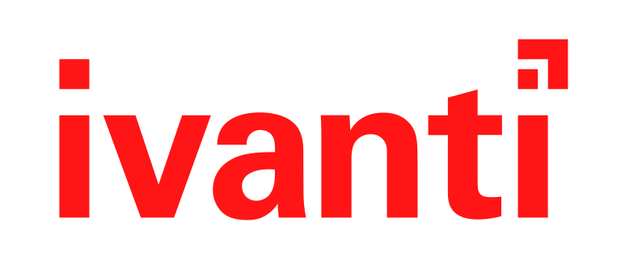

# Bio

Born in 1977 in , I am the son of a winemaker. I got married in 2015 and am a father of ❤️❤️. My professional journey began at the age of 16 with an apprenticeship in electronics at a company specializing in PAL/SECAM modifications and audio-video equipment repair. I then gained experience as a home computer installer within the same company.

After a brief stint in the military, I was fortunate to make IT my career. I started in Level 2 support and later became a packager. During this time, I learned the MSI format and discovered that not all applications install their products in the same way. This led me to the technology of application virtualization with Softgrid, MS Softgrid, and finally MS App-V.

## My Discovery of PowerShell

My exploration of App-V introduced me to PowerShell. From that point on, I seized every opportunity to script my work. I ended up creating a complete, automated, and scalable packaging/delivery solution for my own usage.
This lasted for 1 year before my manager notice and drove me on implementing this solution in the CI/CD process.
The variety of technologies used in this solution (VMWare, WiX, MSI, App-V Sequencer, App-V Server, XenApp) allowed me to develop standard and reusable modules.

As my reputation within the company grew, I was regularly called upon to provide efficient, easily debuggable, and reusable solutions for different teams.

Although my primary role today remains as an application packager, 90% of my activity is focused on implementing PowerShell solutions for workstation teams.

# Experiences over the years

* L1 Global support
* L2 Global support
* L3 Global support
* VIP support
* DRP project manager
* Windows migration (too many)
* Application silencing
* Application packaging
* Application delivery
* Application virtualisation
* Powershell automation
* Powershell tooling

# Scripting / Programming Languages

| Batch | Visual Basic | Powershell | C# | Python |
|------ |------------- |----------- |--- |------- |
|  |  |  |  |  |

# Packaging technologies

| Msi* | Softgrid* | MS App-V* | MS AppX | Msix |
|----- |---------- |---------- |-------- |----- |
|  |  |  |  |  |

\* certified

# Deployment and configuration Management

| Sccm/Mecm/Intune | Citrix XenApp | MS App-V* | Ivanti AppSense |
|----------------- |-------------- |---------- |---------------- |
|  |  |  |  |

\* certified

# Reporting and dashboarding

| Splunk | MS App-V* | Powershell Universal |
|------- |--------- |--------------------- |
|  |  |  |

\* certified

# Sport and hobby

* BMX Race *(3\* National third place, local trainer)* 

* Snowboard *(Freeride, Freestyle)*

  

* MMORPG *(Guild Master, Raid leader)* 

